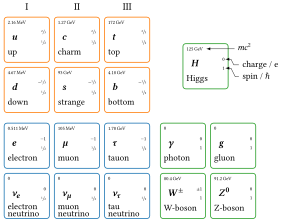

tikz diagram: SM particles
===

This is a little diagram showing the particles of the standard model (SM) I created for my bachelor thesis. 
It is heavily inspired by [this version from Carsten Burgard](https://texample.net/tikz/examples/model-physics) and [the standard wikipedia version](https://commons.wikimedia.org/wiki/File:Standard_Model_of_Elementary_Particles.svg).

Feel free to enhance this and send me your version! 